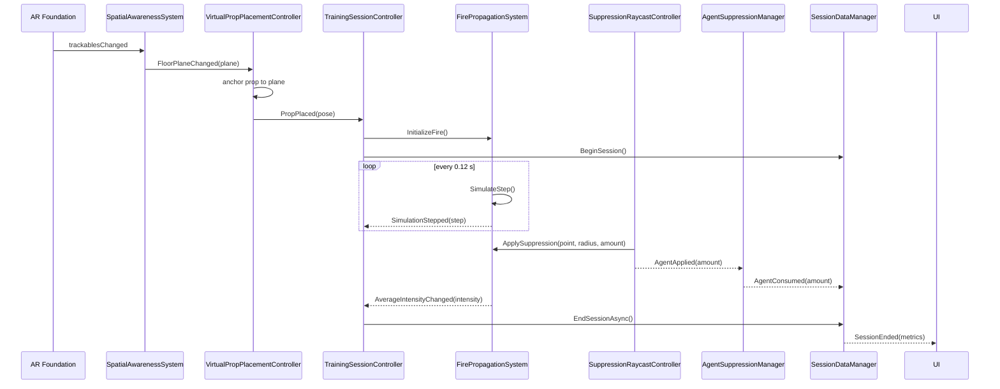

# Technical Architecture Document — MR Fire Safety Training Simulator

**Project:** MR Fire Safety Training Simulator
**Engine:** Unity 6000.3.21f1 LTS · URP 17.3 · Single Pass Instanced
**Target device:** Meta Quest 3 / 3S / Pro (Android, ARM64, Vulkan)
**XR stack:** OpenXR 1.17 + AR Foundation 6.6 + Meta OpenXR 2.5
**Status:** Phases 1–3 implemented, device validation pending

---

## 1. Purpose and scope

The application projects a dynamic virtual fire source — a burning server rack — onto the physical
floor of the user's own room through mixed-reality passthrough. The trainee extinguishes it with a
controller acting as a virtual extinguisher while remaining fully aware of the real space around
them. The system records objective performance metrics for later analysis.

The scope is deliberately narrow: one virtual prop, one fire source, one trainee, one room. There
are no crowds, no navigation, no multiplayer, and no virtual environment — the real room *is* the
environment.

### 1.1 Why mixed reality rather than virtual reality

In fully immersive VR the trainee is transported into a synthetic building, which requires modelling
that building and removes the physical training ground. In MR the virtual prop is added to the real
room: the trainee walks on a real floor, sees real obstacles, and can be supervised by an instructor
standing beside them. The training value lies in the interaction with the fire, not in the
reconstruction of the room.

---

## 2. Architectural overview

The system is layered and event-driven. Dependencies point downwards only; no lower layer holds a
reference to a higher one, and cross-layer communication happens through C# events.

```
Managers      TrainingSessionController · SessionDataManager · AgentSuppressionManager
                                        ↓
Handlers      ParticleCollisionHandler · SuppressionRaycastController · ControllerPoseProvider
                                        ↓
Services      SpatialAnchorService · SessionReportService · DeviceProfiler
              PerformanceProfiler · PerformanceConfigurationService
                                        ↓
Models        SessionMetrics · DeviceProfile · FireSimulationStep
```

### 2.1 Assemblies

Each subsystem is a separate assembly definition, which enforces the dependency direction at compile
time and keeps iteration times low.

| Assembly | Namespace root | Depends on |
|---|---|---|
| `MRFireSafety.Fire` | `MRFireSafety.Fire` | — |
| `MRFireSafety.Suppression` | `MRFireSafety.Suppression` | Fire, Input System |
| `MRFireSafety.Analytics` | `MRFireSafety.Analytics` | Fire, Suppression |
| `MRFireSafety.Core` | `MRFireSafety.Core` | Fire, Suppression, Analytics, AR Foundation, Input System |
| `MRFireSafety.UI` | `MRFireSafety.UI` | Fire, Suppression, Analytics, TMP, uGUI |
| `MRFireSafety.Editor` | `MRFireSafety.Editor` | all of the above (Editor only) |
| `MRFireSafety.Tests.EditMode` | `MRFireSafety.Tests.EditMode` | Fire, Analytics (Editor only) |

`MRFireSafety.Fire` deliberately has no external dependencies: the fire model is pure simulation code
and is therefore unit-testable without an XR device, a scene, or a play-mode session.

### 2.2 Core subsystems

| Subsystem | Key type | Responsibility |
|---|---|---|
| Spatial awareness | `SpatialAwarenessSystem` | Selects the largest tracked horizontal-up plane as the physical floor |
| Anchoring | `SpatialAnchorService` | Attaches the prop to an AR anchor owned by that plane |
| Placement | `VirtualPropPlacementController` | Positions the prop in front of the trainee on the detected floor |
| Session bootstrap | `MixedRealityBootstrapper` | Waits for the AR session, configures the passthrough camera clear |
| Input | `ControllerPoseProvider` | Drives the extinguisher transform from OpenXR controller pose actions |
| Fire model | `FirePropagationSystem` | Cellular-automata intensity grid, propagation and suppression |
| Damage | `FireObjectIntegrityController` | Converts burn time into normalized object integrity |
| Suppression | `SuppressionRaycastController` | Applies agent along the nozzle ray while the trigger is held |
| Agent budget | `AgentSuppressionManager` | Tracks reservoir capacity, gates every suppression source |
| Analytics | `SessionDataManager` | Collects metrics, writes one JSON report per session |
| Orchestration | `TrainingSessionController` | Owns the start and end of a training run |

### 2.3 Event flow



---

## 3. Fire propagation model

### 3.1 Model selection

Computational fluid dynamics solvers such as NIST FDS produce physically faithful fire behaviour but
require minutes to hours of computation per simulated second — impossible inside a 13.9 ms frame
budget. A two-dimensional cellular automaton reproduces the *qualitative* behaviour relevant to
extinguisher training — a fire that grows from a seed, spreads across a surface, resists partial
suppression, and reignites from surviving hot cells — at a cost of a few microseconds per step.

### 3.2 Formulation

The burning surface is discretised into a grid of `W × H` cells lying in a fixed local plane of the
prop (`FireGridPlane.LocalXY` for the vertical rack face). Each cell holds a normalized intensity
`I ∈ [0, 1]`. At each fixed step of duration `Δt = 0.12 s`:

```
I'(x,y) = clamp01( I(x,y) + P · N(x,y) · (1 − I(x,y)) − D · Δt )
```

where

- `N(x,y)` — mean intensity of the four von Neumann neighbours,
- `P` — propagation rate (calibrated to 0.030),
- `D` — natural decay rate (0.025 s⁻¹).

The factor `(1 − I)` saturates growth as a cell approaches full intensity, producing the characteristic
S-shaped growth curve without an explicit fuel model.

Suppression subtracts agent with linear radial falloff over a radius `r` around the impact point:

```
I'(x,y) = clamp01( I(x,y) − A · (1 − d/r) )   for d ≤ r
```

Double buffering guarantees that every cell in a step is evaluated against the same previous state.
Both buffers are allocated once during initialization and reused on restart, so a training run
produces no simulation-related garbage collection.

### 3.3 Calibration

The tuning constants were not chosen by intuition. `FireModelSweepTests` runs the model headlessly
across a grid of candidate values, simulating a trainee sweeping the nozzle across the burning face,
and reports for each combination whether the run is winnable and how long it takes. The sweep
exposed two properties of this model that are not obvious from the equations:

1. **The outcome is bimodal.** Suppression either fails to outpace propagation — in which case the
   fire is mathematically unextinguishable no matter how much agent is applied — or it establishes a
   cleared patch, after which the whole surface collapses within seconds because cleared cells no
   longer feed their neighbours. The interesting parameter space is a narrow band around that
   tipping point. This is arguably realistic: extinguishing a fire does have a tipping point.
2. **Session length is dominated by the growth phase**, not by suppression. Suppression with correct
   technique takes under ten seconds; the time budget of a run comes from how long the trainee
   spends observing, retrieving the extinguisher and approaching.

The initial parameters failed both checks: the fire saturated the whole surface in four seconds and
could not be extinguished at all — 300 simulated seconds of continuous agent, fifteen times the
extinguisher capacity, left it burning at 98 % intensity.

Shipped values and the measured envelope:

| Parameter | Value |
|---|---|
| Grid | 7 × 9 cells at 0.10 m — a 0.70 × 0.90 m burning face on the rack front |
| Propagation rate `P` | 0.030 |
| Natural decay `D` | 0.025 s⁻¹ |
| Agent radius | 0.30 m |
| Agent rate | 0.5 units/s, reservoir 10 units |

| Measurement | Value |
|---|---|
| Average intensity at ignition | 0.016 (one cell of 63) |
| Intensity after 10 / 20 / 40 / 60 s | 0.028 / 0.041 / 0.099 / 0.242 |
| Suppression with correct technique | ≈ 7.6 s |
| Agent consumed | ≈ 3.8 of 10 units |
| Total run, engaging at 40 s | ≈ 48 s |

### 3.4 Completion thresholds

Session completion arms at ignition rather than at a fixed intensity. An earlier design armed
completion only once the average intensity passed 0.1 — a level this fire reaches only after roughly
forty seconds — which meant a trainee who extinguished the fire promptly would leave the session
running forever. The thresholds are therefore placed relative to the ignition average of 0.016:
arming at 0.012 (below it, so a run arms immediately) and completing below 0.006 (also below it, so
a run does not complete the instant it starts).

Any retuning that changes the grid size changes the ignition average, and therefore both thresholds.
`FireModelCalibrationTests` asserts this relationship so the trap cannot be reintroduced silently.

### 3.5 Performance characteristics

- Simulation step: `O(W·H)`, evaluated 8.3 times per second, not per frame.
- Suppression: `O(r²/c²)` — only cells inside the bounding box of the agent radius are visited, so
  the cost is independent of grid size.
- Notifications: `AverageIntensityChanged` is coalesced to at most one invocation per frame in
  `LateUpdate`, which decouples presentation cost from suppression frequency.

---

## 4. Suppression model

Two mechanisms were implemented and are selectable through `SuppressionSourceMode`:

| Mode | Mechanism | Cost | Use |
|---|---|---|---|
| `RaycastOnly` *(default)* | One `Physics.Raycast` per frame from the nozzle | ~1 query/frame | Production |
| `ParticleOnly` | `OnParticleCollision` events from the agent stream | up to 12 impacts/frame | Comparative evaluation |
| `Both` | Both paths active | highest | Measurement only |

Exactly one mode is authoritative at a time. Enabling both would apply each hit twice, which would
invalidate the recorded metrics.

### 4.1 Agent is spent by the trigger, not by the hit

Agent leaves the extinguisher whenever the trainee squeezes the trigger, whether or not the stream
reaches the fire; only suppression requires a hit. An earlier design consumed agent only on contact,
which made poor aim free and left `AgentConsumed` measuring nothing but time on target.

The current model matters for three reasons:

- It is what a real extinguisher does, and "aim before you squeeze" is one of the lessons the
  exercise exists to teach.
- It makes `AgentConsumed` a usable measure of technique: compared against the intensity actually
  removed, it yields an efficiency ratio per session.
- It makes failure reachable. A trainee who sprays wildly empties a finite reservoir and loses the
  fire, which is the `AgentDepleted` outcome.

Discharge accounting lives on the nozzle controller, so it is identical in every suppression mode;
the particle handler only applies intensity reduction and reports nothing about agent.

The particle stream is always rendered: in `RaycastOnly` mode it is a purely visual effect, decoupled
from the suppression logic by separate `SetSprayEnabled` and `SetSuppressionEnabled` gates.

No rigidbodies are used anywhere in the interaction. The prop carries a single trigger `BoxCollider`,
and the suppression ray queries triggers explicitly.

> **Note:** particle collisions ignore trigger colliders. Evaluating `ParticleOnly` mode requires
> clearing `isTrigger` on the prop collider.

---

## 5. Spatial model

1. `ARPlaneManager` reports tracked planes; `SpatialAwarenessSystem` selects the largest
   `HorizontalUp` plane above a minimum area threshold as the floor.
2. `VirtualPropPlacementController` computes a pose 1.5 m ahead of the trainee, projected onto the
   floor height, rotated to face the trainee.
3. `SpatialAnchorService` attaches an `ARAnchor` to that plane and reparents the prop beneath it, so
   the prop stays world-locked as tracking refines.
4. If the platform exposes no anchor subsystem, placement falls back to plain tracked-world
   positioning and logs a warning rather than failing.

The training session does not begin until step 2 succeeds. This keeps room scanning out of the
measured session duration.

---

## 6. Analytics

One JSON report per session is written to `Application.persistentDataPath/SessionReports/` with a
UTC-timestamped filename. Recorded fields:

| Field | Meaning |
|---|---|
| `ScenarioId` | Training scenario identifier |
| `StartedAtUtc` | ISO 8601 session start |
| `DurationSeconds` | Time from ignition to completion |
| `AgentConsumed` | Total extinguishing agent used |
| `ObjectIntegrity` | Remaining integrity of the protected object, 0–1 |
| `FinalFireIntensity` | Mean grid intensity at completion |
| `IsFireSuppressed` | Whether the fire fell below the completion threshold |
| `AverageFramesPerSecond`, `MinimumFramesPerSecond` | In-app frame-rate telemetry |
| `TargetFramesPerSecond` | Refresh rate the device was expected to sustain |
| `Outcome` | How the run ended (see below) |
| `DeviceProfile` | Device model, OS, GPU, memory, core count |

Frame-rate samples are only interpretable against the refresh rate of the specific headset, which
differs between Quest models, so the target is resolved from the XR display at startup and recorded
alongside the measurements rather than assumed to be 72 Hz.

### 6.1 Session outcomes

| Outcome | Trigger |
|---|---|
| `Suppressed` | Fire reduced below the completion threshold |
| `AgentDepleted` | Extinguisher emptied while the fire was still burning |
| `ObjectDestroyed` | Object integrity reached zero before suppression |
| `Interrupted` | Application paused or quit mid-run, for example when the headset was removed |

Interrupted runs are still written to disk — losing a session because a trainee lifted the headset
would be worse than recording an incomplete one — but they must be **excluded from performance
comparisons** during analysis. Filter on this field before aggregating.

Because the interruption path runs during application shutdown, where an awaited write would not
complete, it writes the report synchronously. This is the one place in the project where synchronous
file I/O is intentional; it never executes during a frame.

### 6.2 Repeated sessions

A completed run can be restarted from the controller (B button) without relaunching the application:
the fire is re-ignited, the protected object restored, and the extinguisher refilled. A short lockout
after completion prevents a held button from skipping the results panel. This exists so that an
evaluator can collect a series of comparable sessions in one sitting.

**JSON rather than SQLite.** One report per session, written once at the end of a run, with no
relational queries and no concurrent writers. A file per session is readable directly off the headset
over MTP without tooling, survives partial data loss, and adds no native dependency to the Android
build. SQLite would add an `.so` per architecture for no analytical benefit at this data volume.

All file I/O is asynchronous (`File.WriteAllTextAsync`) and never executes inside `Update()`.

---

## 7. Performance budget

The target is a sustained 72 FPS, i.e. 13.9 ms per frame, on Quest 3 hardware.

| Decision | Rationale |
|---|---|
| URP with Single Pass Instanced stereo | Halves per-eye draw call submission |
| Low-poly primitive geometry (< 5 K triangles for the whole prop) | Mobile vertex budget |
| One point light on the fire, shadows disabled | Real-time shadows are the dominant mobile GPU cost |
| Particle caps: 96 fire, 32 smoke, 128 agent | Bounded overdraw |
| Trigger colliders and raycasts instead of rigidbodies | Removes the physics solver from the frame |
| Fixed 0.12 s simulation tick | Decouples simulation cost from frame rate |
| Pre-allocated buffers and reused collision-event lists | No steady-state garbage collection |
| Frame pacing left to the XR compositor | `Application.targetFrameRate` is ignored or harmful in XR; the display refresh rate is read, not overridden |

`PerformanceProfiler` samples frame rate in-app twice per second and records the mean and minimum in
the session report. Unity Profiler and OVR Metrics remain the authority for device measurements.

### 7.1 Measured content budget

`TrainingSceneBudgetTests` opens the generated scene and measures its static cost, so that content
regressions are caught before a device build rather than after:

| Metric | Measured | Budget |
|---|---|---|
| Triangles | 444 | 10 000 |
| Mesh renderers | 20 | 40 |
| Shadow-casting lights | 0 | 0 |
| Particle capacity | 256 | 400 |

These figures confirm the scene is far from the geometry and overdraw limits of the platform; if the
frame target is missed on device, the cause will be elsewhere — stereo resolution, passthrough
composition, or CPU work — and profiling should start there rather than with the mesh budget.

**What this does not establish.** Static content budgets cannot confirm a sustained frame rate. GPU
frame time, stereo rendering cost, passthrough composition and real thermal behaviour are only
measurable on the headset, and the 72 FPS target remains unverified until then.

## 7.2 Interface comfort

The training panel is world-space and follows the gaze with a dead zone rather than being parented to
the camera. A rigidly head-locked panel moves with every micro-motion of the head, which reads as the
world dragging and is a well-known source of discomfort in stereo. `HeadFollowPanelController` leaves
the panel still while the gaze stays within 14° of it, then eases it back to a resting place 1.6 m
ahead and slightly below the eye line, keeping it upright rather than copying head roll.

The thresholds are exposed for tuning because comfort is individual and can only be judged while
wearing the device.

---

## 8. Coding standards

- `PascalCase` for public members and types; `_camelCase` for private fields.
- `Manager` / `Handler` / `System` / `Controller` / `Service` suffixes reflect the layer.
- `Is` / `Has` / `Can` prefixes for booleans.
- XML documentation on every public type and member, including parameters, return values and
  exceptions.
- Event-driven communication; no polling of other components in `Update()`.
- No synchronous file I/O in the frame loop.
- No single-letter identifiers except loop counters.

## 9. Open decisions and risks

| Item | Status |
|---|---|
| Device validation of plane detection and anchor stability | Pending first Quest deployment |
| Calibration of propagation, decay and suppression rates for a 40–90 s session | Pending device testing |
| Sustained 72 FPS confirmation under Unity Profiler | Pending |
| Head-locked HUD ergonomics in stereo | Pending user feedback |
